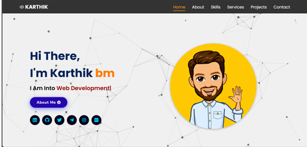

<h1 align="center">Portfolio Website</h1>

  

<h3 align="center">A personal portfolio website build by karthik bm </h3>

<a href="https://karthikbm.infy.uk/" target="_blank">**Visit Now** 🚀</a>

If you'd like to **contribute** and make this much better for other users, have a look at [Issues](https://github.com/karthikbm33/Portfolio-Website/issues/1#issue-2975549049).

## Portfolio Sections
😃 Summary and About me\
👓 Skills\
📚 Education\
💻 Projects\
✔️ Services\
 🏆 Achievements And Certifications \
📲 Contact

## Tools Used 🛠️

  
  
  
  
  

###

## License

- **[MIT license](http://opensource.org/licenses/mit-license.php)**

<h2 align="left">Stay connected  </h2>

###

  
  
  
  
  
  
  

###

###

<h3>https://karthikbm.infy.uk/</h3>
