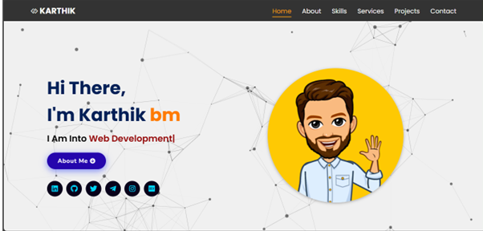

<div align="center">


<br/>

[](https://karthikbm.infy.uk/)&nbsp;
[](https://github.com/karthikbm33)&nbsp;
[](https://github.com/karthikbm33/Portfolio-Website/issues)

</div>

---

## 📸 Preview

<div align="center">
  
</div>

<br/>

---

## 📌 Sections

<div align="center">

| # | Section |
|:---:|:---|
| 😃 | **About Me** — Summary & introduction |
| 👓 | **Skills** — Technical skill set |
| 📚 | **Education** — Academic background |
| 💻 | **Projects** — Work & personal projects |
| ✔️ | **Services** — What I offer |
| 🏆 | **Achievements** — Certifications & awards |
| 📲 | **Contact** — Get in touch |

</div>

---

## 🛠️ Tools Used

<div align="center">

&nbsp;&nbsp;
&nbsp;&nbsp;
&nbsp;&nbsp;
&nbsp;&nbsp;
&nbsp;&nbsp;


</div>

---

## 🤝 Contributing

Contributions are welcome! If you'd like to improve this portfolio:

```
1. 🍴  Fork this repository
2. 🌿  git checkout -b feature/your-idea
3. ✏️   Make your changes
4. 📤  git push origin feature/your-idea
5. 🔁  Open a Pull Request
```

👉 Check open [Issues](https://github.com/karthikbm33/Portfolio-Website/issues) for ideas!

---

## 🔗 Connect with Me

<div align="center">

[](https://linktr.ee/karthikbm)&nbsp;
[](http://www.linkedin.com/in/karthikbm33)&nbsp;
[](https://x.com/Karthikbm33)&nbsp;
[](mailto:karthikshet21@yahoo.com)

</div>

---

<div align="center">
⭐ **Star this repo if you like it!**

*Made with ❤️ by **[Karthik BM](https://karthikbm.infy.uk/)***


</div>
